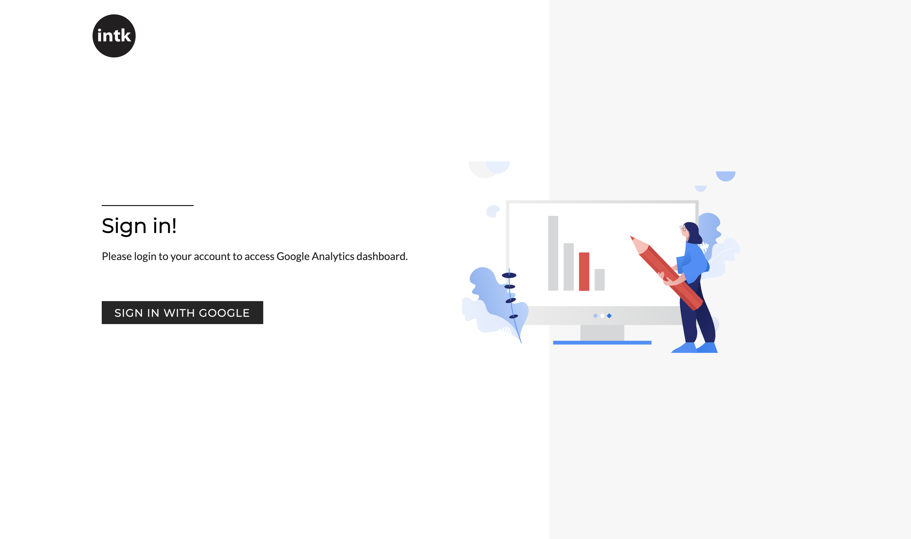
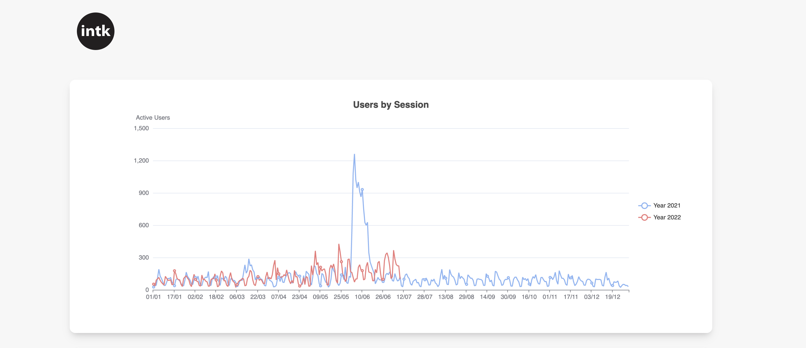
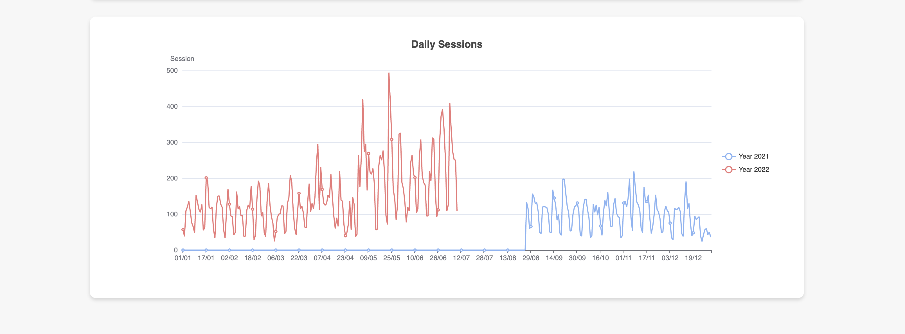

# Custom Google Analytics Dashboard

Custom Google Analytics Dashboard based on Google Analytics Data API v1.

<p float="left">
    
    
    
</p>

## Technologies

-  [React.js](https://reactjs.org/)
-  [Google Analytics API](https://developers.google.com/analytics/devguides/reporting/data/v1)
-  [Apache ECharts](https://echarts.apache.org/en/index.html)
-  [React OAuth2 | Google](https://github.com/MomenSherif/react-oauth)

## Local Setup

1. Clone this repo
2. Create project in [Google Developers Console](https://console.developers.google.com/)
3. Enable Google Analytics Reporting API.
4. Configure Google OAuth consent screen.
5. Add your CLIENT_ID and PROPERTY_ID into .env file:

    ```shell
   REACT_APP_CLIENT_ID='YOUR_CLIENT_ID'
   REACT_APP_PROPERTY_ID='GA4_PROPERTY_ID'
    ```

6. Run `npm install`
7. Run `npm start`

This project was bootstrapped with [Create React App](https://github.com/facebook/create-react-app).
